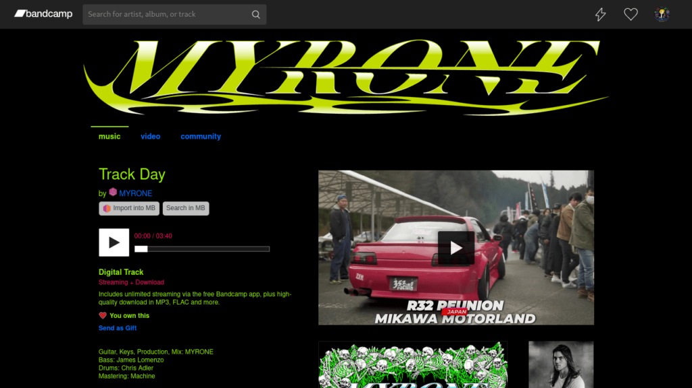
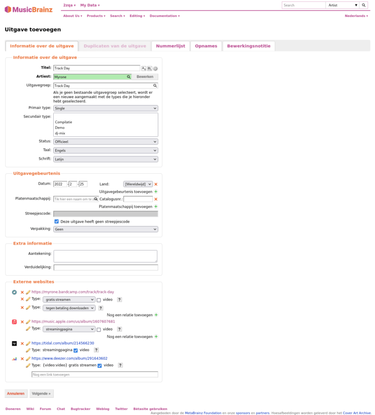
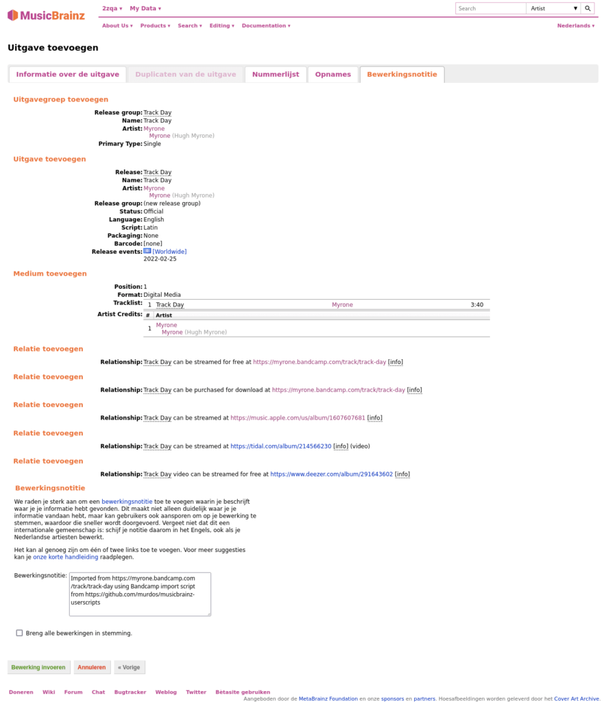
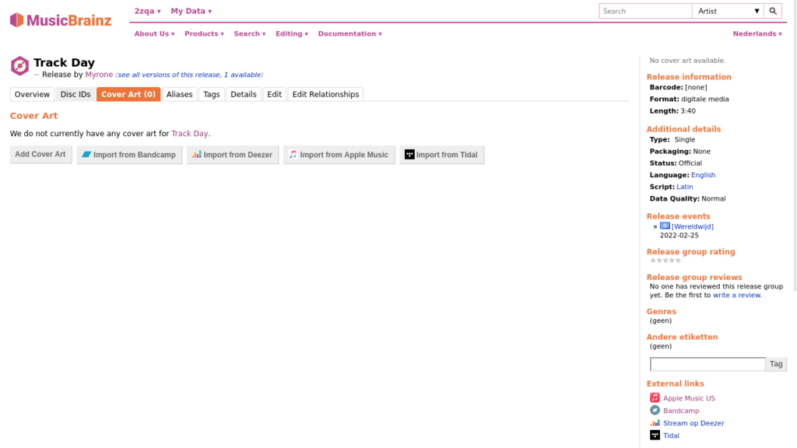

**AANPASSING:** Onnodige stappen weggehaald en uitleg over streepjescodes toegevoegd. Bedankt aerozol!

MusicBrainz Picard is een programma om je lokale muziekbibliotheek bij te houden. Het maakt gebruik van de open muziekencyclopedie MusicBrainz. Wanneer het werkt is het fijn, maar soms wordt muziek niet herkend. Wat doe je dan?

<!--more-->

Als je muziek niet herkend wordt, betekent dit dat het nog niet op MusicBrainz staat. Je zou kunnen wachten tot iemand anders het doet, maar dan kan je soms lang wachten. Daarom leg ik je in dit artikel uit hoe je het heft in eigen handen kan nemen, in de vorm van korte, beknopte instructies.

## Voorbereiding

1. Installeer violentmonkey ([Firefox][1], [Chrome][2]) en vervolgens [dit userscript][3] en [dit userscript][4].
2. (Voor AcoustID) Open MusicBrainz picard en ga naar Opties > Opties > Vingerafdrukken en druk onder API-sleutel op de knop "API-sleutel verkrijgen". Volg de stappen en vul je API-sleutel in.

## Importeren

1. Ga naar Bandcamp pagina die je wil importeren, e.g. https://myrone.bandcamp.com/track/track-day
2. Druk op "Import into MB". (Als je deze knop niet ziet, zorg dat je het userscript correct geïnstalleerd hebt)

3. Verander de volgende velden:
   * Artiest: Als het vakje niet groen is, druk op het vergrootglas en kies de juiste artiest.
   * Streepjescode: als het nummer ook op Spotify, iTunes of Deezer staat, kan je met de desbetreffende URL op https://atisket.pulsewidth.org.uk de streepjescode (barcode/UPC) verkrijgen.
   * Externe websites: Eigen invulling. Met bovengenoemde pagina kan je behalve de streepjescode ook de URL voor Spotify, Apple Music/iTunes en Deezer verkrijgen. Verdere voorbeelden van externe websites zijn TIDAL en SoundCloud.

4. Druk op "Volgende" tot je uitkomt bij Bewerkingsnotitie
5. Controleer alle informatie en druk tenslotte op "bewerking invoeren". Dat was het!

## Albumhoes toevoegen

1. Ga naar release pagina en dan naar de cover art pagina
2. Druk op "Import from Bandcamp"

3. Wacht tot de albumhoes geladen is en druk op "Bewerking invoeren"

## (Optioneel) AcoustID toevoegen

Door een [AcoustID][5] toe te voegen kunnen nummers herkend worden gebaseerd op hun geluid.

Instructies herleid van: https://picard-docs.musicbrainz.org/en/usage/submit_acoustid.html

1. Open de MusicBrainz Picard applicatie
2. Sleep je muziek naar de linkerkolom en druk op "opzoeken"
3. Selecteer alle muziek in de rechterkolom en druk op AcoustID's versturen

[1]: https://addons.mozilla.org/nl/firefox/addon/violentmonkey/
[2]: https://chrome.google.com/webstore/detail/violentmonkey/jinjaccalgkegednnccohejagnlnfdag
[3]: https://raw.github.com/murdos/musicbrainz-userscripts/master/bandcamp_importer.user.js
[4]: https://github.com/ROpdebee/mb-userscripts/raw/dist/mb_enhanced_cover_art_uploads.user.js
[5]: https://en.wikipedia.org/wiki/AcoustID
